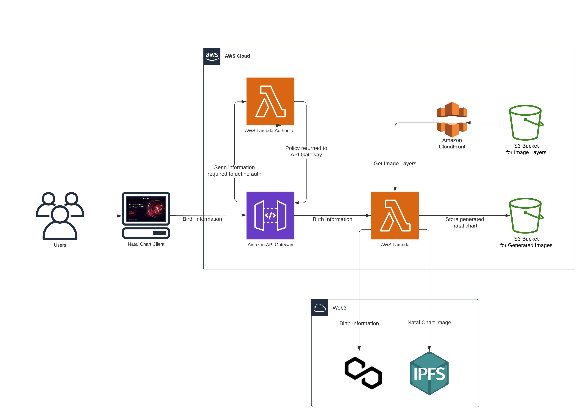

# Lens X Astrace Natal Chart App

[README is not yet complete]

An app that generates natal charts based on a person's birth information. The natal charts are "minted" as [Lens Publications](https://docs.lens.xyz/docs/publication) and the birth information is stored as metadata in the minters Lens [ProfileNFT](https://docs.lens.xyz/docs/profile). The repo is organized into four main components:
- natal chart generation (`./natal-chart-generation`)
- smart contracts (`./blockchain`)
- frontend (`./frontend`)
- deployment code (`./cdk`)

## Table of Contents

- [Table of Contents](#table-of-contents)
- [Getting Started](#getting-started)
  - [Prerequisites](#prerequisites)
  - [Installation](#installation)
- [Usage](#usage)
  - [Image Algorithm](#image-algorithm)
  - [Frontend](#frontend)
  - [Smart Contracts](#smart-contracts)
- [Deployment](#deployment)

## Getting Started

### Prerequisites

### Installation

## Architecture Overview

This project uses Amazon Web Services (AWS) as the cloud provider to build and deploy our custom architecture.
Since our application generates images "on the fly" instead of pre-generating them (like most NFT projects),
it demands tailored architecture and efficient performance.



To define and manage our custom cloud architecture, we use the [AWS Cloud Development Kit (AWS CDK)](https://aws.amazon.com/cdk/).
AWS CDK is a framework used to define cloud infrastructure as code (IaC).

All AWS CDK related files are located in the `cdk` directory of this repository. This directory contains the necessary code, configuration files, and scripts to define and deploy our cloud infrastructure. **For complete documentation, see the [README file](./cdk/README.md) in that directory.**


## Usage

### Image Algorithm

For detailed information about the algorithm, [click here](./natal-chart-generation/README.md).

#### Running Locally

Change directory. Set up a virtual environment. Install dependencies. Run script.
```
cd natal-chart-generation
python -m venv .venv
source .venv/bin/activate
pip install -r requirements.txt
./natal_chart_cli.py -h
```

#### Testing Locally

#### Running Remotely
See: [Deployment](#deployment)

### Frontend

The frontend is built using Next.js 14. **See the full frontend-specific README file [here](./frontend).**

### Smart Contracts

## Deployment

### Continuous Deployment
Both the frontend and the image generatation code are deployed anytime there is a change made to
their respective directories in the `production` branch. See:
- [./.github/workflows/deploy-cdk-stack.yml](./.github/workflows/deploy-cdk-stack.yml)
- [./.github/workflows/deploy-frontend-to-vercel.yml](./.github/workflows/deploy-frontend-to-vercel.yml)

General workflow when changes in `main` are ready to be deployed is:
```
git checkout main
git pull
git checkout production
git merge main
git push
```

### Local Deployment
To locally deploy image generation code on AWS services,
see: [AWS Local Deployment](https://github.com/astrace/LensXAstrace-NatalChartApp/tree/main/cdk#local-deployment)

To locally deploy frontend code via Vercel,
see: [Vercel Deployment](https://github.com/astrace/LensXAstrace-NatalChartApp/tree/main/frontend#deployment)

## Note on Integration

Things to know about how the different parts of the project interact (natal chart generation, cdk, frontend, blockchain)

### Setting up domain name

When the domain name is finalized, several parts of the code will need to be updated: [TODO]
