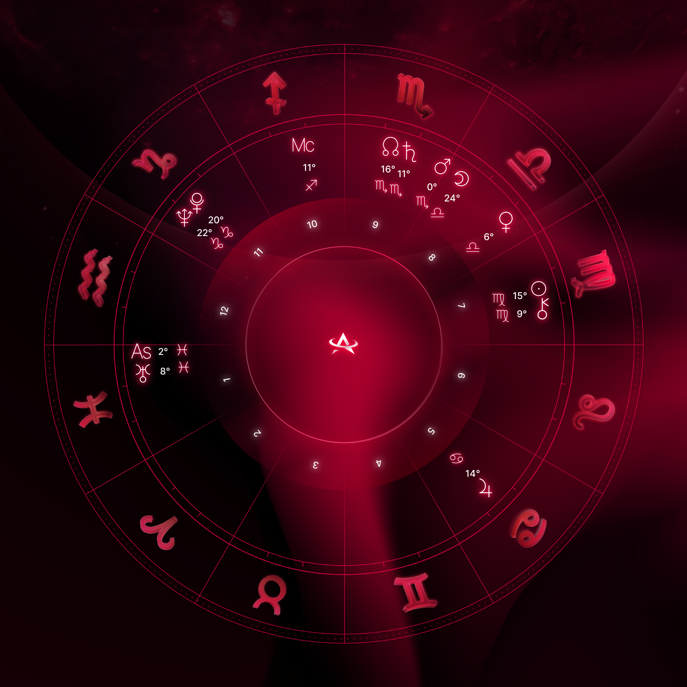
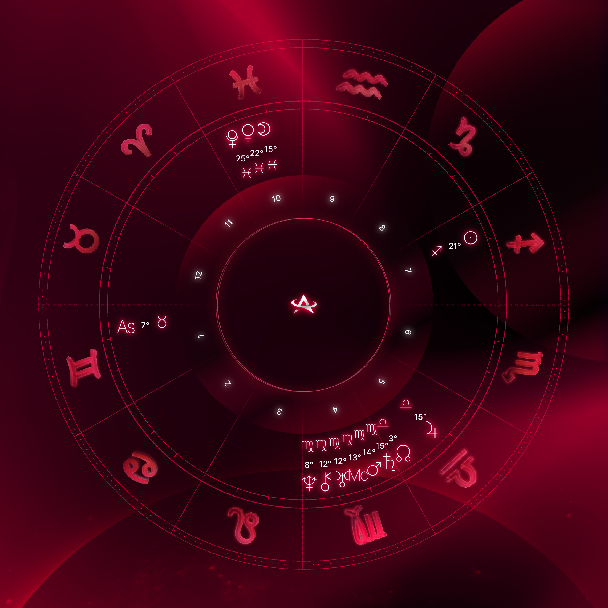

# Lens X Astrace Natal Chart App

An app that generates natal charts based on a person's birth information. The natal charts are "minted" as [Lens Publications](https://docs.lens.xyz/docs/publication) and the birth information is stored as metadata in the minters Lens [ProfileNFT](https://docs.lens.xyz/docs/profile). 

<table>
  <tr>
    <td>
      
      <br>
      <em>example image 1</em>
    </td>
    <td>
      
      <br>
      <em>example image 2</em>
    </td>
    <td>
      
      <br>
      <em>example image 3</em>
    </td>
  </tr>
</table>

## Table of Contents

- [Table of Contents](#table-of-contents)
- [Getting Started](#getting-started)
  - [Requirements](#requirements)
  - [Installation](#installation)
- [Repo Structure](#repo-structure)
- [Usage](#usage)
  - [Image Algorithm](#image-algorithm)
  - [Architecture Overview](#architecture-overview)
  - [Frontend](#frontend)
  - [Web3 Integration](#web3-integration)
- [Deployment](#deployment)
- [Notes on Integration](#notes-on-integration)

## Getting Started

### Requirements
- Python 3.7 **and** Python 3.8+
- Node.js 14+
- AWS CLI
- AWS CDK
- Vercel CLI

### Installation
- Clone the repository.
- Follow the installation steps in each component's README file.

## Repo Structure

The repo is organized into four main components:
- natal chart generation (`./natal-chart-generation`)
- smart contracts (`./blockchain`)
- frontend (`./frontend`)
- deployment code (`./cdk`)

## Usage

### Image Algorithm

For detailed information about the algorithm, [click here](./natal-chart-generation/README.md).

#### Running Locally

Change directory. Set up a virtual environment. Install dependencies. Run script.
```
cd natal-chart-generation
python -m venv .venv
source .venv/bin/activate
pip install -r requirements.txt
./natal_chart_cli.py -h
```

#### Running Remotely
See: [Deployment](#deployment)

### Architecture Overview

This project uses Amazon Web Services (AWS) as the cloud provider to build and deploy our custom architecture.
Since our application generates images "on the fly" instead of pre-generating them (like most NFT projects),
it demands tailored architecture and efficient performance.


To define and manage our custom cloud architecture, we use the [AWS Cloud Development Kit (AWS CDK)](https://aws.amazon.com/cdk/).
AWS CDK is a framework used to define cloud infrastructure as code (IaC).

All AWS CDK related files are located in the `cdk` directory of this repository. This directory contains the necessary code, configuration files, and scripts to define and deploy our cloud infrastructure. **For complete documentation, see the [README file](./cdk/README.md) in that directory.**

### Frontend

The frontend is built using Next.js 14. **See the full frontend-specific README file [here](./frontend).**

### Web3 Integration

For more information about the Web3 integration (namely, integrating with Lens Protocol) used in this project,
see the README file in the `blockchain` directory.

## Deployment

### Continuous Deployment
Both the frontend and the image generatation code are deployed any time there is a change made to
their respective directories in the `production` branch. See:
- [./.github/workflows/deploy-cdk-stack.yml](./.github/workflows/deploy-cdk-stack.yml)
- [./.github/workflows/deploy-frontend-to-vercel.yml](./.github/workflows/deploy-frontend-to-vercel.yml)

General workflow when changes in `main` are ready to be deployed is:
```
git checkout main
git pull
git checkout production
git merge main
git push
```

### Local Deployment
This shouldn't be necessary, but in case you don't want to rely on the GitHub Actions files to deploy to prod
and instead want to do it "manually".

To locally deploy image generation code on AWS services,
see: [AWS Local Deployment](https://github.com/astrace/LensXAstrace-NatalChartApp/tree/main/cdk#local-deployment)

To locally deploy frontend code via Vercel,
see: [Vercel Deployment](https://github.com/astrace/LensXAstrace-NatalChartApp/tree/main/frontend#deployment)

## Notes on Integration

Things that affect multiple parts of the project (natal chart generation, cdk, frontend, blockchain).

### Setting up domain name

When the domain name is finalized:
1. Add the custom domain name on the [Vercel website](https://vercel.com/docs/concepts/projects/domains/add-a-domain).
2. Set the environment variable in
[this workflow file](https://github.com/astrace/LensXAstrace-NatalChartApp/blob/3fa15e493ce4dd7719842711f8f9fd41678ff617/.github/workflows/deploy-cdk-stack.yml).
