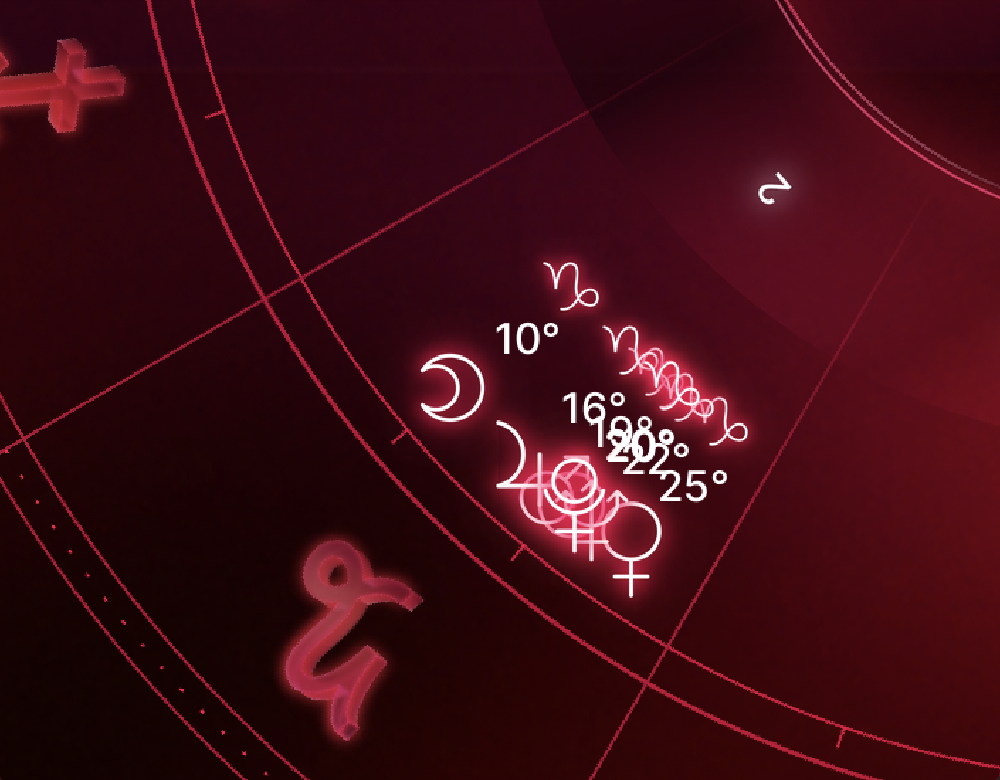
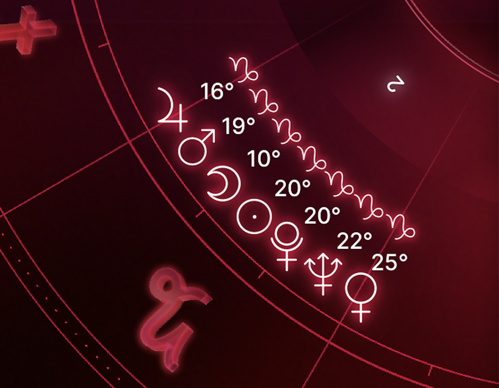

# Astrace Natal Chart Generation

### Helper Custom Image Rendering Algorithms

### Spreading planets
This is important for rendering things like conjunctions, stelliums, etc (where planets may overlap). See `find_clumps` and `spread_planets` in `utils.py`.

Before/After:

    
    

### TODO

