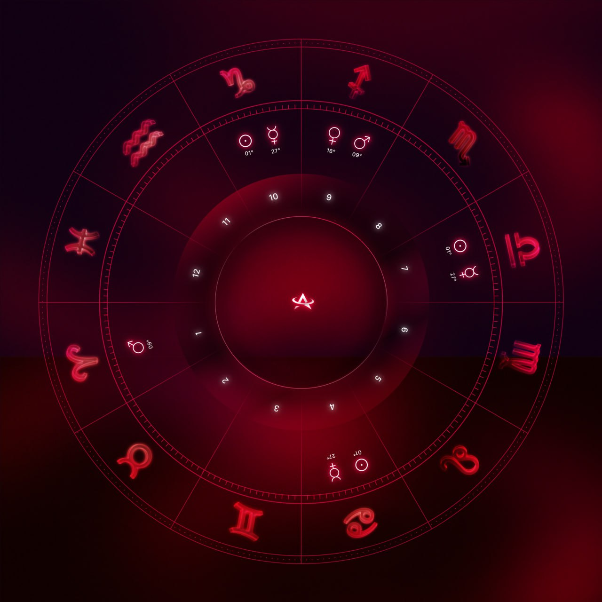

# TODO

<figure>

<figcaption align = "center">Design spec for natal chart NFT</figcaption>
</figure>
  
## Backend

### 1. Image generation algorithm

An algorithm for generating a natal chart (exactly like the one above) given birth information. Is written using Python Pillow & Kerykeion astro library.

1. [✓] Convert birth information to correct chart orientation & planet placement
    * See: `natal_chart_gen/prototype.py`
2. [Est. 1-2 days] Adjustments to make generated image look like design spec
    * E.g. Sizing of assets, house numbers, degree text
3. [Optional] Randomize background so images are more unique.

### 2. Setup server & API

Setup a server for the above image generation script & create an API for requesting natal chart.
That is, the API takes a POST request containing birth information and returns an image / link to image.

1. [✓] Setup S3 services and pipeline for deployment.
    * See: workflows in `.github/workflows`
2. [✓] [Est. 1/2 day] Speed up image generation. Use AWS CloudFront.

### 3. Minting contract

1.  [Est. 2-3 days] Look at [ProfileNFT](https://docs.lens.xyz/docs/profile) specs on LENS Protocol and write NFT minting contract. 
    * Note: This should be audited (or at least looked over by several devs) before actual launch.
    Not really necessary for milestone check-in stage.

## Frontend

[Est. 3-5 days]
