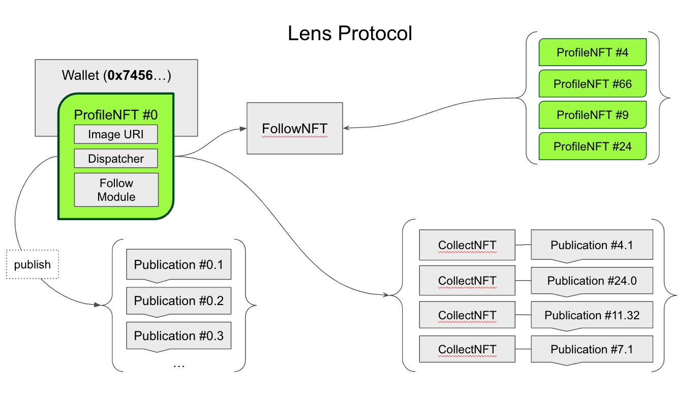
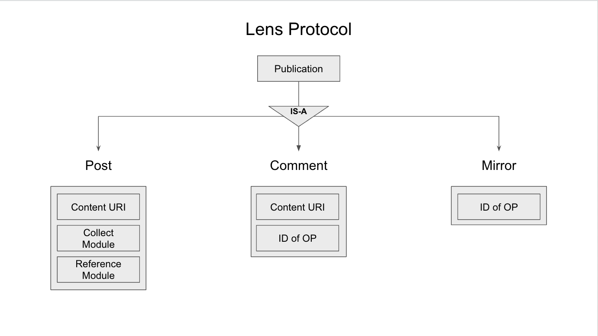

# Lens Protocol Integration

## Background Context

[Lens Developer Docs](https://docs.lens.xyz/docs)

<table>
  <tr>
    <td>
      
       
      <em>Diagram of Lens Protocol</em>
    </td>
    <td>
      
       
      <em>Publication Data Type</em>
    </td>
  </tr>
</table>

### NFTs vs Lens Publications

There's some complex and nuanced reasoning for why it makes most sense to "mint" the natal chart
as a Lens Publication instead of a 'traditional' NFT (e.g. ERC-721). This design decision
is explained in [this presentation](./assets/AstraceXLensProtocolIntegration.pdf).
