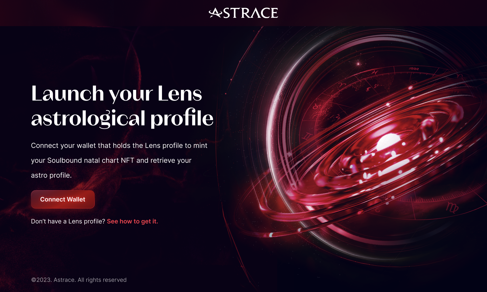
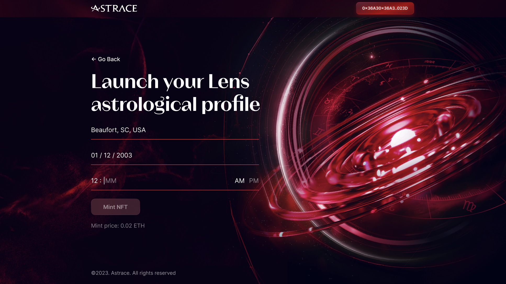

# Natal Chart Generation Frontend

This is the frontend for the Lens X Astrace Natal Chart Generation App. It has a simple landing page and a form page for birth information. The form page only becomes accessible when the user connects to Polygon with their Web3 wallet. This is a [Next.js](https://nextjs.org/) project bootstrapped with [`create-next-app`](https://github.com/vercel/next.js/tree/canary/packages/create-next-app).

<table>
  <tr>
    <td>
      
      <br>
      <em>Landing page</em>
    </td>
    <td>
      
      <br>
      <em>Form page</em>
    </td>
  </tr>
</table>

## Table of Contents

[TODO]

## Requirements
- Node.js 14.6.0 or newer

## Getting Started

In the `frontend` directory, run the development server:

```bash
npm run dev
# or
yarn dev
# or
pnpm dev
```

Open [http://localhost:3000](http://localhost:3000) with your browser to see the result.

## Figma Design Files

Figma design files can be found [here](https://www.figma.com/file/YIFQ1a77HUtXqQk87830pF/Astrace---Website?node-id=741-23909&t=KdAV4NrbABOnXg7k-0).

## Deploying on Vercel

- Set up a [Vercel](https://vercel.com/) account and project, and add `VERCEL_TOKEN`, `VERCEL_ORG_ID`, and `VERCEL_PROJECT_ID` as [secrets](https://docs.github.com/en/actions/security-guides/encrypted-secrets).
  - See instructions [here](https://vercel.com/guides/how-can-i-use-github-actions-with-vercel#configuring-github-actions-for-vercel) on how to get these values.
- Deployment should be entirely handled by [this](../.github/workflow/deploy-frontend-to-vercel.yml) Github Actions workflow. That is, anytime there is a push made to the `production` branch, the frontend will be deployed via Vercel CLI. 
- Setting up a custom domain can be done via the Vercel website. See [here](https://vercel.com/docs/concepts/projects/domains/add-a-domain).

