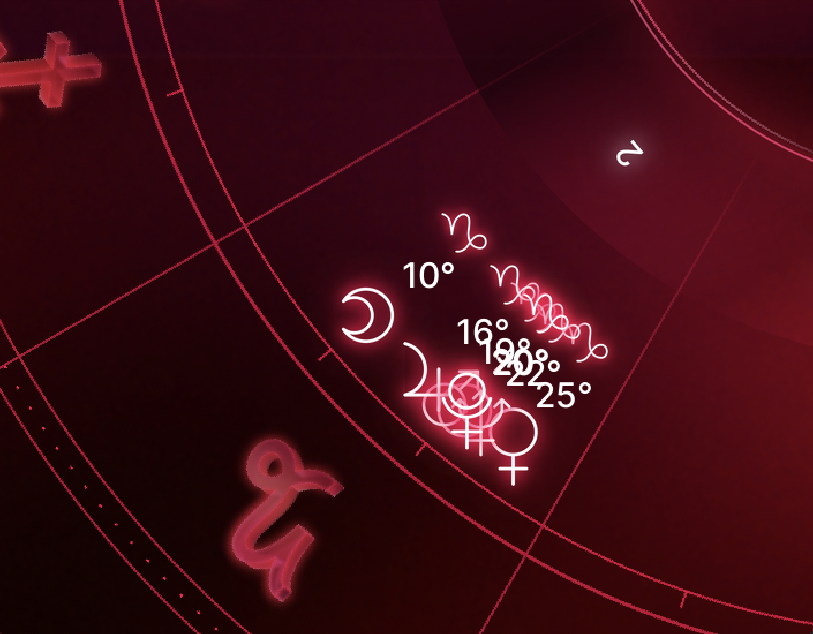
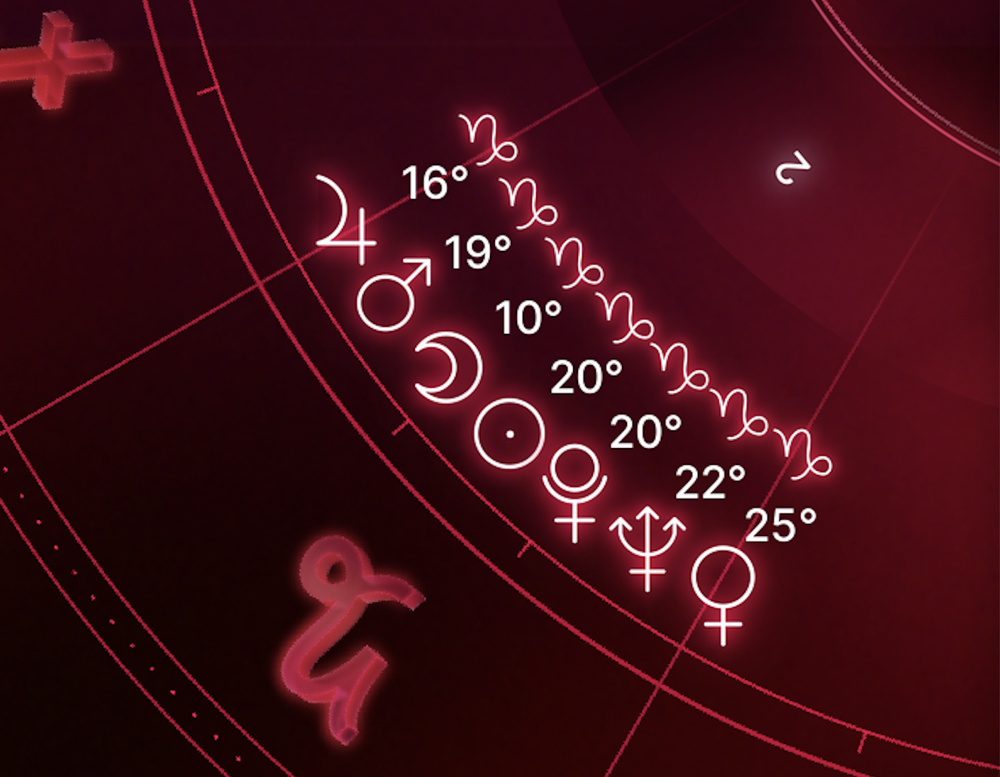

# Astrace Natal Chart Generation

## Testing

We use the unittest and pytest frameworks to create and run test cases for the natal chart generation program. The tests are designed to cover various scenarios, such as:
- natal charts with stelliums
- different background images
- planets near 0/360 degrees on the circle.

Due to the nature of the problem, we rely on **manual visual inspection** of the generated natal chart images to determine if they are rendered correctly. Test results, including comments about any issues, are saved to a log file for further analysis. In case of failed test cases, we provide functionality to retest them at a later time using the data stored in the log file.

### Helper Custom Image Rendering Algorithms

### Spreading planets
This is important for rendering things like conjunctions, stelliums, etc (where planets may overlap). See `find_clumps` and `spread_planets` in `utils.py`.

Before/After:

    
    

### TODO

## Testing

Testing is mostly manual. Test file `test.py` simply generates random natal charts and displays them. See: `./assets/test_recording.mov` for an example.

