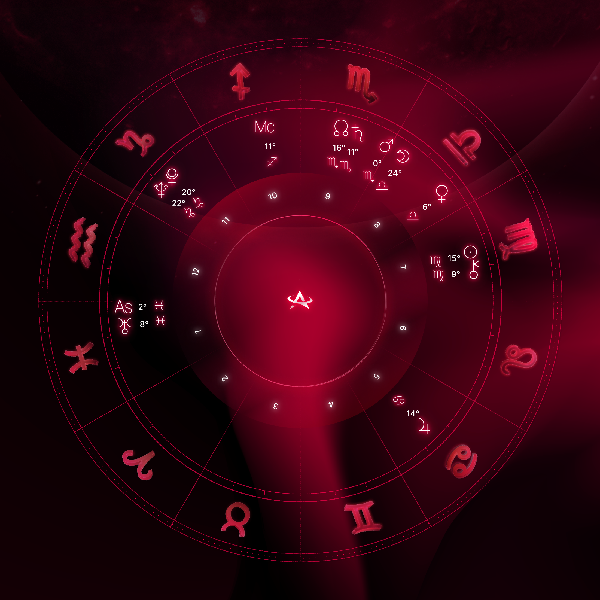

# Natal Chart Image Generator

This code in this directory generates an image of a natal chart based on a user's birth information.

<table>
  <tr>
    <td>
      
      <br>
      <em>example image 1</em>
    </td>
    <td>
      
      <br>
      <em>example image 2</em>
    </td>
    <td>
      
      <br>
      <em>example image 3</em>
    </td>
  </tr>
</table>

## Image Generation Algorithm

The image generation algorithm used in this script consists of the following steps:

1. Validate the input data (date, time, and location of birth) and convert it into the required format,
namely [Julian days](https://www.astro.com/swisseph/swephprg.htm#_Toc112949005).
2. Set background layers of the image (see: `set_background_layers` function).

    - Randomly select one of several background images, some are rarer than others (see: `constants.py`).
    - Set the zodiac wheel (i.e. rotate it) depending on the users ascendant sign.
    - Paste the house numbers and central logo.

3. Detect any clump of planets and spread them out evenly to avoid visual overlap. See [TODO].
4. Resize all image layers.
**Note: Image sizes are all defined in terms of the dimensions of the main background layer.**
This is done in order to minimize the "degrees of freedom" when parameterizing image layer sizes.
See: `image_params.py` and `LocalImageLoader.resize_all_images` in `utils.py`.
  
5. Paste the planets, signs, and text in the appropriate location. Note this requires converting a degree to an absolute position (in pixels) on the background image while taking into account the ascendant.  
6. Return the generated natal chart image as a PIL Image object.

## File Structure

- `natal_chart.py`: The main script that contains the image generation algorithm and helper functions.
- `constants.py`: Contains constants used in the script, such as image file paths and planet names.
- `image_params.py`: Contains parameters related to the image generation, such as sizes and positions.
- `utils.py`: Contains utility functions for image manipulation, including loading images from local and remote sources.

## Usage

### Local

You can locally generate a natal chart using the CLI. To learn how to use the natal_chart_cli.py script, simply run:
```
./natal_chart_cli.py -h
```
This will generate a natal chart for a person born on January 1st, 2022 at 12:00:00 local time in New York City (latitude 40.7128, longitude -74.0060).

## Testing

We use the unittest and pytest frameworks to create and run test cases for the natal chart generation program. The tests are designed to cover various scenarios, such as:
- natal charts with stelliums
- different background images
- planets near 0/360 degrees on the circle.

Due to the nature of the problem, we rely on **manual visual inspection** of the generated natal chart images to determine if they are rendered correctly. Test results, including comments about any issues, are saved to a log file for further analysis. In case of failed test cases, we provide functionality to retest them at a later time using the data stored in the log file.

### Running tests

[Here's a video](https://www.youtube.com/watch?v=L_4tYsyH3q4) showing the testing workflow (sped up 4x).

---

Basic tests:
```
python -m unittest test_natal_chart.BasicTestNatalChart
```
Visual tests:
```
python -m unittest test_natal_chart.VisualTestNatalChart
```
The test results, along with comments and Unix timestamps for failed cases, will be stored in the `test_results.log` file.

## Custom Image Rendering

### Spreading planets
This is important for rendering things like conjunctions, stelliums, etc (where planets may overlap).
See `find_clumps` and `spread_planets` in `utils.py`. **Note these algorithms are rather non-trivial 
and should be edited/refactored with great care.**

Before/After:
<div>
    
    
</div>

